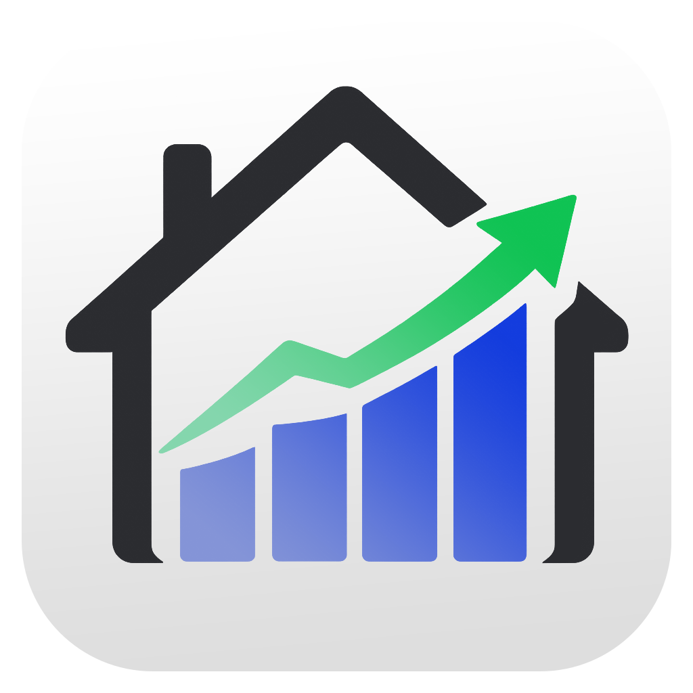
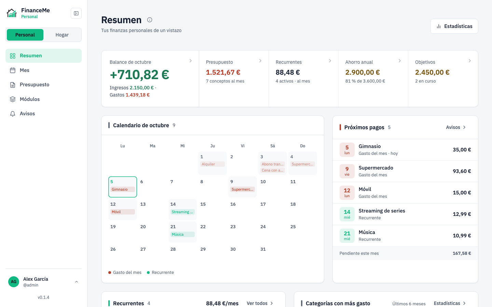
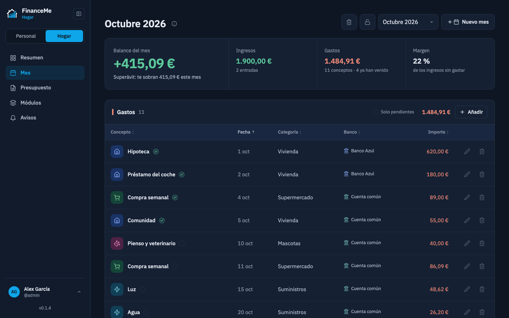
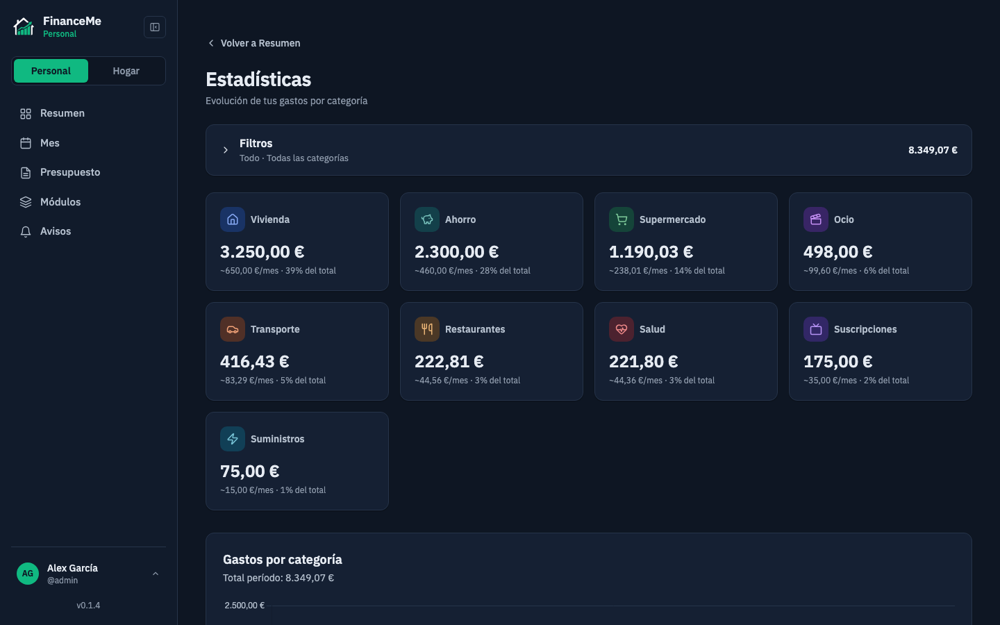
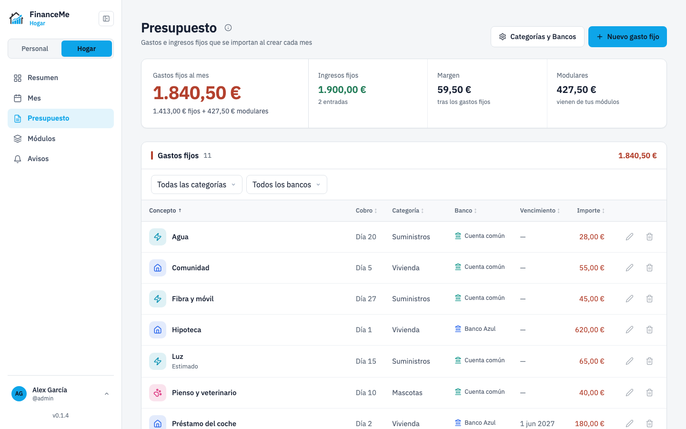

<div align="center">
  

  # FinanceMe

  Aplicación web de gestión financiera personal y del hogar. Registra gastos, ingresos, préstamos, pagos recurrentes y servicios (luz, agua), con presupuesto, ahorro anual, objetivos, avisos de próximos pagos y estadísticas mes a mes.
</div>

---

> **Aviso de seguridad:** esta aplicación está pensada para uso en red local o privada. **No se recomienda exponerla directamente a internet** sin un proxy inverso con HTTPS, autenticación adicional y el hardening adecuado.

## 1. Instalación con Docker Compose

**Requisitos:** [Docker](https://docs.docker.com/get-docker/) y [Docker Compose](https://docs.docker.com/compose/install/).

Crea un `docker-compose.yml`:

```yaml
services:
  financeme:
    image: ghcr.io/imrsquare/financeme:latest
    container_name: financeme
    restart: unless-stopped
    ports:
      - "3000:3000"
    volumes:
      - ./data:/app/data
    env_file:
      - .env
```

Para usar otro puerto en tu máquina, cambia solo el de la izquierda; por ejemplo, `"3019:3000"` deja la app en el puerto 3019.

Junto a él, crea un archivo `.env` (ver [Variables de entorno](#3-variables-de-entorno)) con al menos `JWT_SECRET` y tu zona horaria:

```bash
echo "JWT_SECRET=$(openssl rand -base64 48)" > .env
echo "TZ=Europe/Madrid" >> .env
```

Tienes todas las variables comentadas en [`.env.example`](.env.example).

Y levántalo:

```bash
docker compose up -d
```

La aplicación estará disponible en [http://localhost:3000](http://localhost:3000). Los datos se guardan en `./data/` (volumen local), así que persisten entre reinicios y actualizaciones.

La imagen incluye un *healthcheck*: tras unos segundos, `docker ps` muestra el contenedor como `(healthy)`.

Para actualizar a la última versión:

```bash
docker compose pull && docker compose up -d
```

Para pararla:

```bash
docker compose down
```

## 2. Valores por defecto de usuario y contraseña

En el primer arranque se crea automáticamente un usuario administrador:

| Campo      | Valor      |
|------------|------------|
| Usuario    | `admin`    |
| Contraseña | `admin123` |

⚠️ Se te pedirá cambiarla en el primer inicio de sesión — hazlo antes de continuar.

## 3. Variables de entorno

| Variable     | Descripción                                                                | Requerida |
|--------------|-----------------------------------------------------------------------------|-----------|
| `JWT_SECRET` | Secreto para firmar los tokens de sesión. Mínimo 32 caracteres aleatorios. | Sí        |
| `HTTPS`      | Poner a `true` solo si el tráfico llega directamente por HTTPS sin proxy. Por defecto `false`. | No |
| `TZ`         | Zona horaria del servidor, usada para decidir qué pagos son «hoy» y «mañana» en las notificaciones (p. ej. `Europe/Madrid`). Por defecto, UTC. | Recomendada |
| `AVISOS_HORA` | Hora (0–23) a partir de la cual se envían las notificaciones del día. Por defecto `9`. | No |
| `VAPID_PUBLIC_KEY` / `VAPID_PRIVATE_KEY` | Claves para las notificaciones push. Si no se indican, se generan solas la primera vez y se guardan en la base de datos. | No |
| `VAPID_SUBJECT` | Contacto del administrador para los servicios push (`mailto:tu@correo` o una URL `https://`). | No |
| `AVISOS_DISABLED` | Poner a `true` para desactivar el envío de notificaciones. | No |
| `UPDATE_CHECK` | Poner a `false` para que el servidor no consulte GitHub en busca de versiones nuevas. | No |

## 4. Primer acceso

1. Abre [http://localhost:3000](http://localhost:3000) desde el mismo equipo, o `http://<IP-de-tu-servidor>:3000` desde otro dispositivo de tu red local.
2. Inicia sesión con las credenciales por defecto (`admin` / `admin123`) y cambia la contraseña cuando se te solicite.
3. Cambia entre **Personal** (tus finanzas) y **Hogar** (gastos compartidos de la casa) desde el menú lateral; en el móvil, desde el menú de tu cuenta. Hogar lo activa el administrador la primera vez que lo abre.
4. Ve a **Presupuesto › Categorías y Bancos** para crear tus categorías y bancos antes de dar de alta tu primer gasto: de ahí se nutren los filtros, las estadísticas y los desplegables del resto de la app.

## 5. Avisos y notificaciones

La sección **Avisos** (en Personal y en Hogar) muestra los pagos de este mes y del siguiente: los gastos del Presupuesto con día de cobro y los Recurrentes con fecha de cobro (salvo en los meses que hayas excluido). Desde ahí puedes activar las **notificaciones en cada dispositivo**; se envían la víspera y el mismo día de cada pago, a partir de la hora indicada en `AVISOS_HORA`.

Requisitos del navegador:

- **HTTPS obligatorio.** Los navegadores solo permiten notificaciones en páginas servidas por HTTPS (o desde `localhost`). Si accedes por `http://<IP>:3000`, pon delante un proxy inverso con certificado (Caddy, Nginx Proxy Manager, Traefik, Tailscale Serve…).
- **iPhone / iPad:** iOS 16.4 o superior y la app **instalada en la pantalla de inicio** (Safari → Compartir → «Añadir a pantalla de inicio»). Después, abre FinanceMe desde el icono y actívalas en Avisos.
- **Android y escritorio:** Chrome, Edge, Firefox o Safari recientes.

Configura `TZ` con tu zona horaria para que «hoy» y «mañana» coincidan con tu calendario. Las claves VAPID se generan solas; si cambias de servidor sin conservar la carpeta `data/`, tendrás que volver a activar las notificaciones en cada dispositivo.

## 6. Actualizaciones

Cada 12 horas el servidor consulta la última versión publicada en [GitHub Releases](https://github.com/iMrSquare/FinanceMe/releases). Si hay una más reciente, los administradores ven el aviso junto a la versión en el menú y, en **Configuración › Actualizaciones**, las novedades y los comandos para actualizar:

```bash
docker compose pull
docker compose up -d
```

Tus datos, en la carpeta `data/`, se conservan. Tras actualizar, quien tenga la aplicación abierta verá el aviso «FinanceMe se ha actualizado» con un botón para recargar.

La comprobación solo lee la API pública de GitHub. Se desactiva con `UPDATE_CHECK=false`.

> **Si vienes de v1.x:** desde la v0.1.4 las versiones se numeran 0.1.x (v1.2.0 pasó a ser v0.1.3). Una instalación en v1.2.0 no avisará de las nuevas: actualízala a mano una vez con los comandos de arriba.

## 7. Imágenes de la aplicación

<table>
  <tr>
    <td></td>
    <td></td>
  </tr>
  <tr>
    <td align="center"><sub>Personal · Resumen (claro)</sub></td>
    <td align="center"><sub>Hogar · Mes (oscuro)</sub></td>
  </tr>
  <tr>
    <td></td>
    <td></td>
  </tr>
  <tr>
    <td align="center"><sub>Personal · Estadísticas (oscuro)</sub></td>
    <td align="center"><sub>Hogar · Presupuesto (claro)</sub></td>
  </tr>
</table>

---

## Licencia

MIT — ver [LICENSE](LICENSE).
