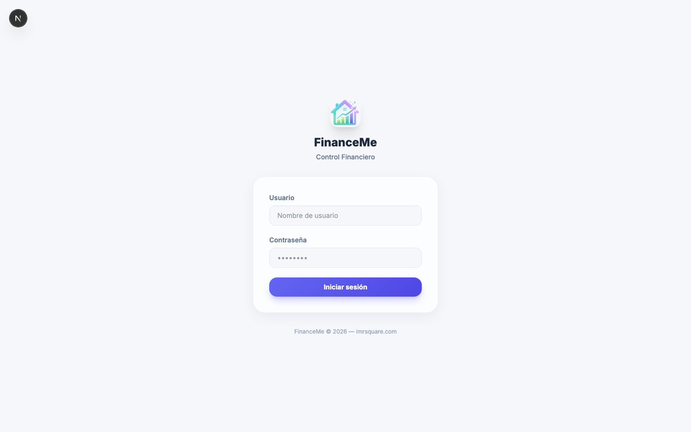
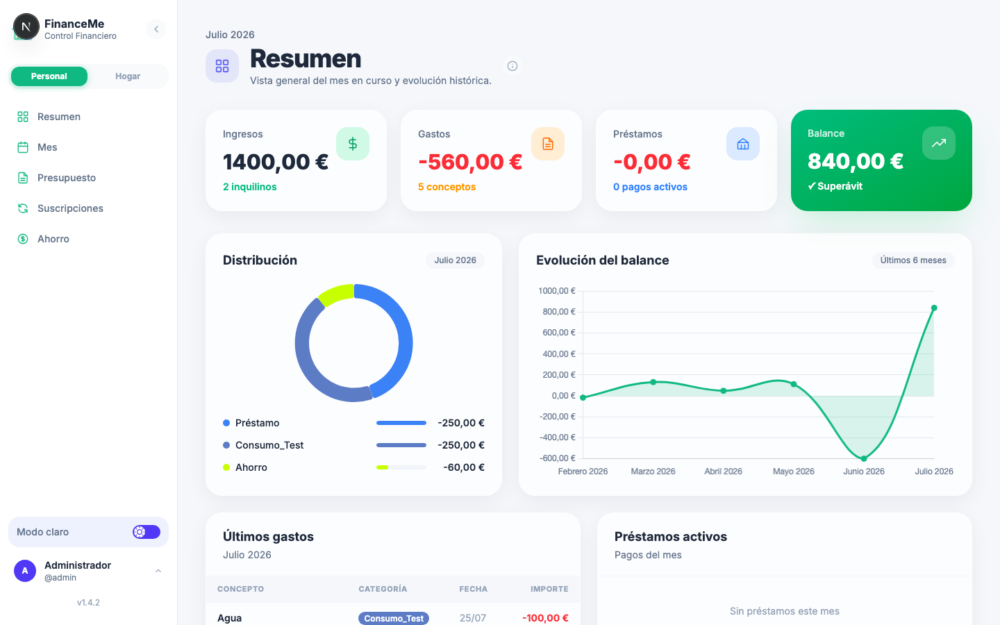
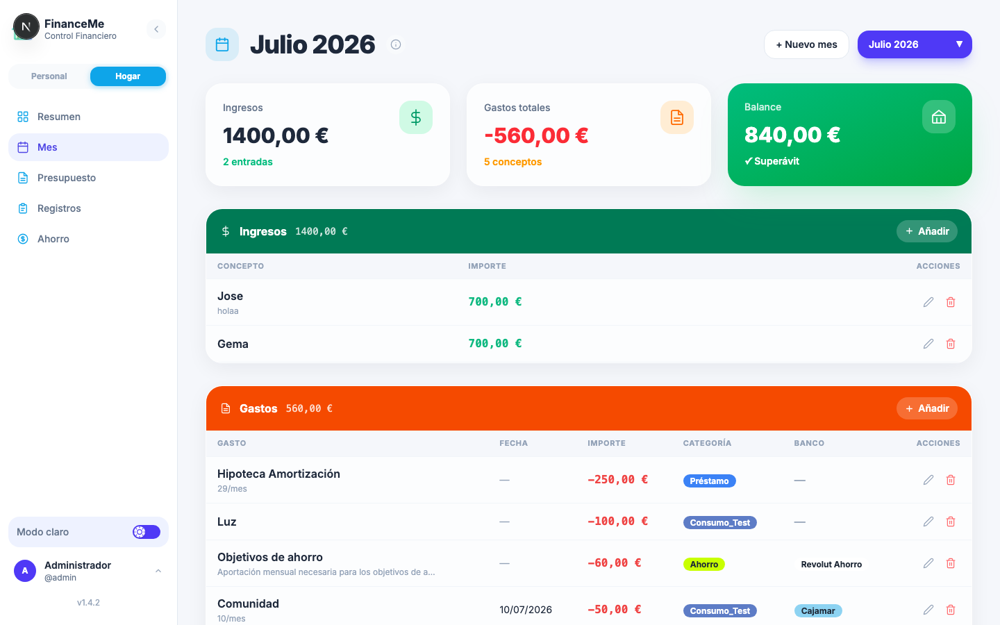
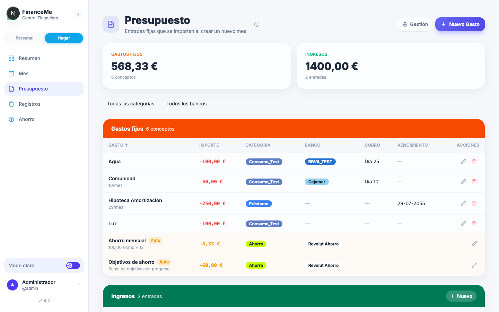
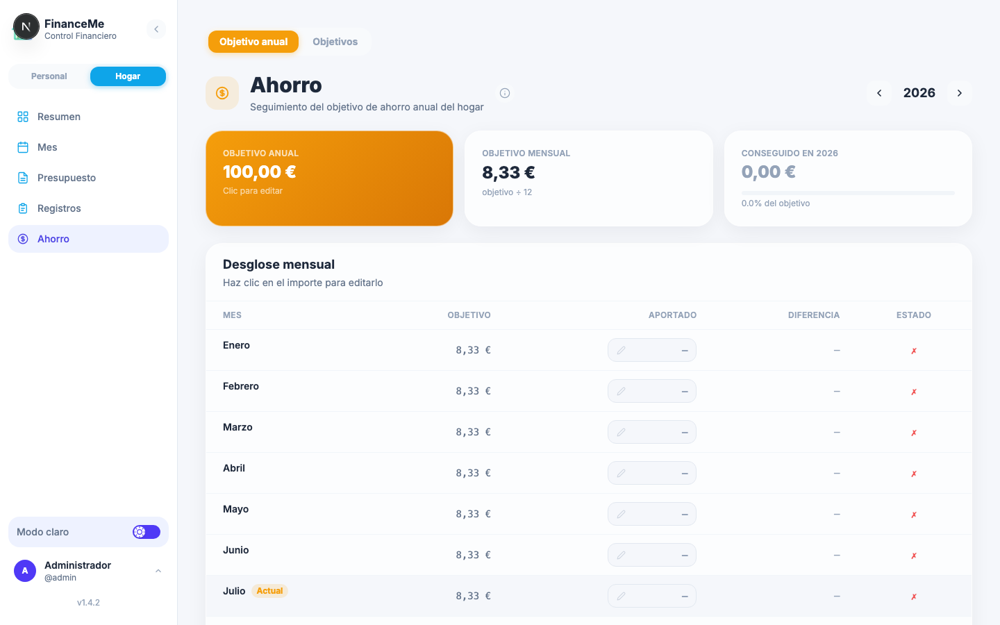
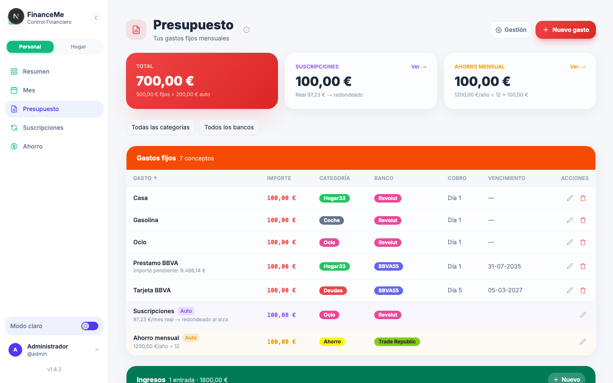
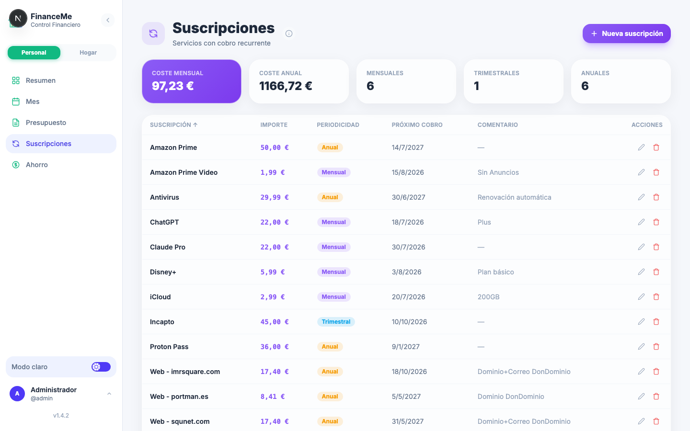
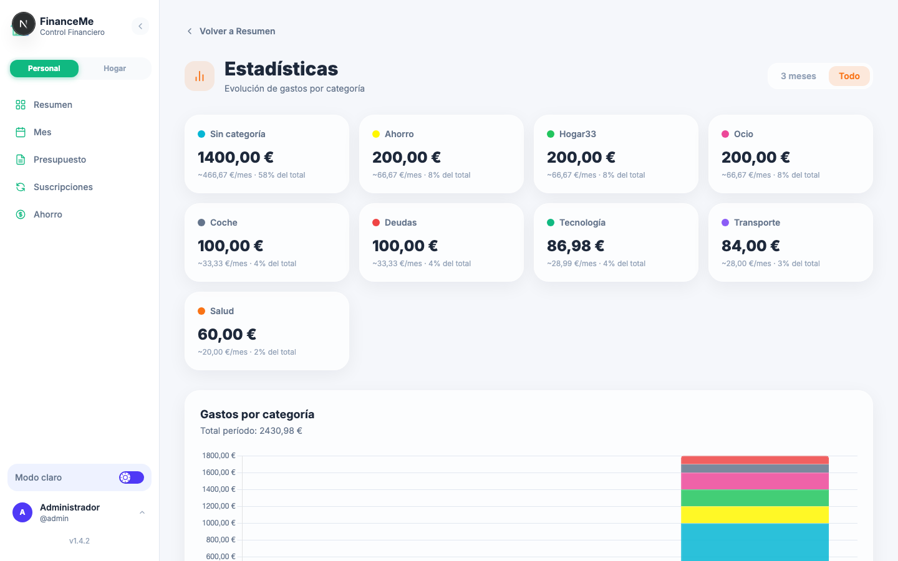

<div align="center">
  

  # FinanceMe

  Aplicación web de gestión financiera personal y del hogar. Registra gastos, ingresos, préstamos, suscripciones y servicios (luz, agua), con presupuesto, objetivos de ahorro y estadísticas mes a mes.
</div>

---

> **Aviso de seguridad:** esta aplicación está pensada para uso en red local o privada. **No se recomienda exponerla directamente a internet** sin un proxy inverso con HTTPS, autenticación adicional y el hardening adecuado.

## 1. Instalación con Docker Compose

**Requisitos:** [Docker](https://docs.docker.com/get-docker/) y [Docker Compose](https://docs.docker.com/compose/install/).

Crea un `docker-compose.yml`:

```yaml
services:
  financeme:
    image: ghcr.io/imrsquare/financeme:latest
    container_name: financeme
    restart: unless-stopped
    ports:
      - "3000:3000"
    volumes:
      - ./data:/app/data
    env_file:
      - .env
    healthcheck:
      test: ["CMD", "node", "-e", "require('http').get('http://localhost:3000/',r=>process.exit(r.statusCode<500?0:1)).on('error',()=>process.exit(1))"]
      interval: 30s
      timeout: 10s
      retries: 3
      start_period: 20s
```

Junto a él, crea un archivo `.env` (ver [Variables de entorno](#3-variables-de-entorno)) con al menos `JWT_SECRET`:

```bash
echo "JWT_SECRET=$(openssl rand -base64 48)" > .env
```

Y levántalo:

```bash
docker compose up -d
```

La aplicación estará disponible en [http://localhost:3000](http://localhost:3000). Los datos se guardan en `./data/` (volumen local), así que persisten entre reinicios y actualizaciones.

Para actualizar a la última versión:

```bash
docker compose pull && docker compose up -d
```

Para pararla:

```bash
docker compose down
```

## 2. Valores por defecto de usuario y contraseña

En el primer arranque se crea automáticamente un usuario administrador:

| Campo      | Valor      |
|------------|------------|
| Usuario    | `admin`    |
| Contraseña | `admin123` |

⚠️ Se te pedirá cambiarla en el primer inicio de sesión — hazlo antes de continuar.

## 3. Variables de entorno

| Variable     | Descripción                                                                | Requerida |
|--------------|-----------------------------------------------------------------------------|-----------|
| `JWT_SECRET` | Secreto para firmar los tokens de sesión. Mínimo 32 caracteres aleatorios. | Sí        |
| `HTTPS`      | Poner a `true` solo si el tráfico llega directamente por HTTPS sin proxy. Por defecto `false`. | No |

## 4. Primer acceso

1. Abre [http://localhost:3000](http://localhost:3000) desde el mismo equipo, o `http://<IP-de-tu-servidor>:3000` desde otro dispositivo de tu red local.
2. Inicia sesión con las credenciales por defecto (`admin` / `admin123`) y cambia la contraseña cuando se te solicite.
3. Elige el modo **Hogar** (gastos compartidos) o **Personal** (finanzas individuales) desde el interruptor de la barra lateral — puedes usar ambos con la misma cuenta.
4. Ve a **Gestión** para crear tus categorías y bancos antes de dar de alta tu primer gasto: de ahí se nutren los filtros, las estadísticas y los desplegables del resto de la app.

## 5. Imágenes de la aplicación

<table>
  <tr>
    <td></td>
    <td></td>
  </tr>
  <tr>
    <td align="center"><sub>Inicio de sesión</sub></td>
    <td align="center"><sub>Resumen</sub></td>
  </tr>
  <tr>
    <td></td>
    <td></td>
  </tr>
  <tr>
    <td align="center"><sub>Hogar · Mes</sub></td>
    <td align="center"><sub>Hogar · Presupuesto</sub></td>
  </tr>
  <tr>
    <td></td>
    <td></td>
  </tr>
  <tr>
    <td align="center"><sub>Hogar · Ahorro</sub></td>
    <td align="center"><sub>Personal · Presupuesto</sub></td>
  </tr>
  <tr>
    <td></td>
    <td></td>
  </tr>
  <tr>
    <td align="center"><sub>Personal · Suscripciones</sub></td>
    <td align="center"><sub>Estadísticas</sub></td>
  </tr>
</table>

Más capturas (Gestión, Registros de luz/agua, Ajustes, Perfil…) disponibles en la carpeta [`/img`](img).

---

## Licencia

MIT — ver [LICENSE](LICENSE).
